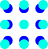
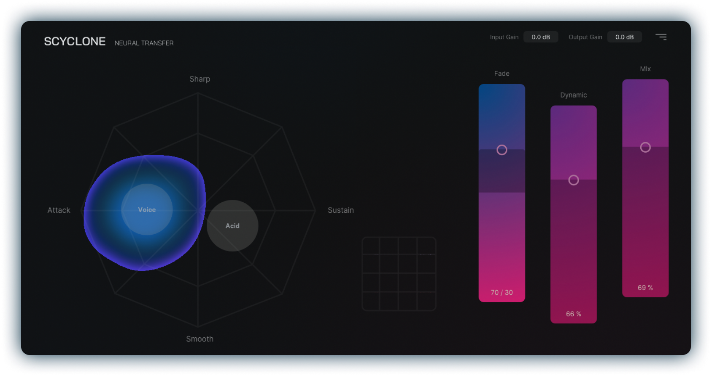
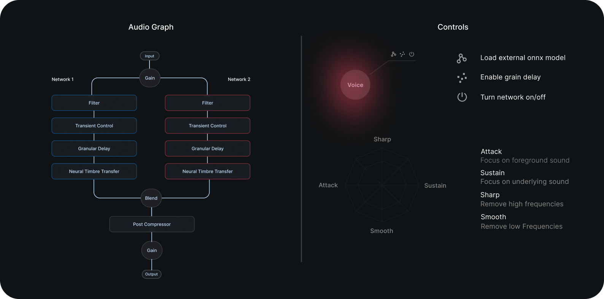

#  &nbsp; SCYCLONE


**Scyclone** is an audio plugin that utilizes **neural timbre transfer** technology to offer a new approach to audio production. The plugin builds upon [RAVE](https://github.com/acids-ircam/RAVE) methodology, a realtime audio variational auto encoder, facilitating neural timbre transfer in both single and couple inference mode. <br /><br />
This enables a new artificial layering technique to be applied on the incoming signal in creating richer drum pallets, fuller atmospheres or simply transferring the timbre of the raw signal to another sound pallet. To further control the behaviour and production of the neural networks, we have internally equipped the plugin with signal processings modules allowing the user to shape, control and embellish the source and target timbres in a distinct manner.

## Overview



**Signal flow**: <br />

Scyclone offers an intuitive signal flow to seamlessly influence the model's synthesis using pre-processing effects:

- Transient Controller: Shape the attack and sustain of the audio.
- Low-/High-Cut Filter: Refine the frequency range of input audio for a more consistent sound
 
After the synthesis, you can further enrich the output with these additional modules:
 
- Grain Delay: Add depth and texture to each model's output by applying a granular delay
- Blend: Crossfade between the outputs of the models and create a harmonious mix
- Post-Compressor: Control the dynamics of the out-going signal and glue the sounds together

**Trained models**:
Scyclone runs on **onnx** format. We have provided two pre-trained models in this repository, accessible under **assets/models** directory.

- **Funk Drums**: This model is trained on four hours of data inspired by the captivating sounds of vintage drum-breaks
- **Djembe**: Trained on five hours of carefully compiled Djembe dataset (Three hours of djembe solo performances and two hours of one-shot recordings)

## Installation
The plugin uses the onnxruntime libary to inference our neural networks. At the present time the library is included as a shared library, so it is necessary to put the shared library next to the exectutable or in your system libaray path. 

Detailed instructions can be found here:
- [Windows Guide](docs/install_instructions_windows.md).
- [Mac Guide](docs/install_instructions_mac.md).

## Build instruction
If you are on macOS you need to install the onnxruntime v1.12.1 library via homebrew:
```bash
brew install faressc/scyclone/onnxruntime@1.12.1
```
Build with CMake
```bash
# clone the repository
git clone https://github.com/Torsion-Audio/Scyclone
cd Scyclone/

# initialize and set up submodules
git submodule update --init --recursive

# build plugin (on macOS specify the processor type with the flag -DCMAKE_HOST_SYSTEM_PROCESSOR)
cmake . -B cmake-build (-DCMAKE_HOST_SYSTEM_PROCESSOR=x86_64 or arm64)
cmake --build cmake-build --config Release
```

**Note:** On Windows CMake should automatically download the prebuild onnxruntime library (version 1.12.1). **If the script fails**, download the library manually:

- Download [onnx v1.12.1](https://github.com/microsoft/onnxruntime/releases/tag/v1.12.1) (Select your required prebuild)
- Extract the file and rename to the folder ```onnxruntime-1.12.1```
- Copy to folder to ```path/to/Scyclone/modules/```
- Now you sould have the following file structes ```Scyclone/modules/onnxruntime-1.12.1/include```

## References

- RAVE Paper - [RAVE: A variational autoencoder for fast and high-quality neural audio synthesis](https://arxiv.org/abs/2111.05011)
- RAVE Scripts - [RAVE Github Repository](https://github.com/acids-ircam/RAVE)
- RNBO Tutorial - [JUCE & RNBO C++ Export](https://kengo.dev/posts/jr-granular)

## License
This project is subject to multiple licenses. The primary license for the entire project is the GNU General Public License version 3 (GPLv3), which is the most restrictive of all the licenses applied herein.
 - The Granular Delay module located at ```modules/RnboExport/``` is licensed under the [GPLv3](https://support.cycling74.com/hc/en-us/articles/10730637742483-RNBO-Export-Licensing-FAQ)
 - All pretrained onnx models located at ```assets/models/``` are licensed under the [Creative Commons Attribution-NonCommercial 4.0 International License](https://github.com/acids-ircam/RAVE/blob/master/LICENSE) 
 - All other code within this project is licensed under the MIT License.
