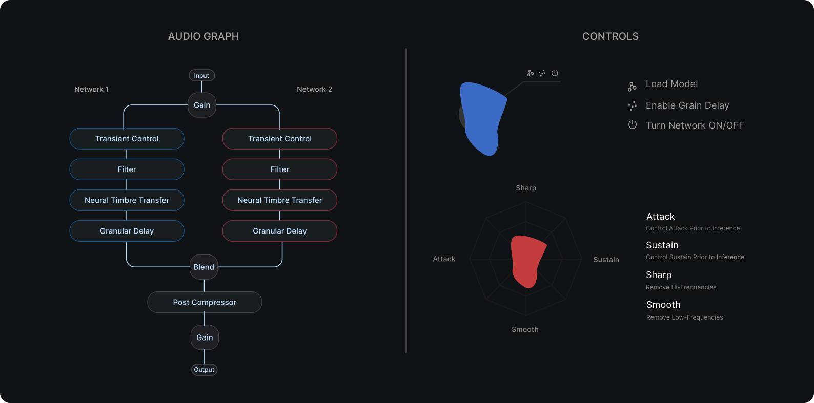

#  &nbsp; SCYCLONE


**Scyclone** is an audio plugin that utilizes **neural timbre transfer** technology to offer a new approach to audio production. The plugin builds upon [RAVE](https://github.com/acids-ircam/RAVE) methodology, a realtime audio variational auto encoder, facilitating neural timbre transfer in both single and couple inference mode. <br /><br />
This enables a new artificial layering technique to be applied on the incoming signal in creating richer drum pallets, fuller atmospheres or simply transferring the timbre of the raw signal to another sound pallet. To further control the behaviour and production of the neural networks, we have internally equipped the plugin with signal processings modules allowing the user to shape, control and embellish the source and target timbres in a distinct manner.

## Overview



**Signal flow**: <br />

Scyclone offers an intuitive signal flow allowing for a seamless influence over inference and sound synthesis. The pre-processing modules are:

- Transient Controller: Shaping the attack and sustain of the singal
- Low-/High-Cut Filter: Refining the frequency range of input audio favouring a consistent sound
 
Additional in-built postprocessing modules permit for further manipulation and formation of the timbre transferred signal. The post-processing modules are:
 
- Grain Delay: Adding depth and texture
- Blend: Crossfades between the outputs of the models and obtain a harmonious mix
- Post-Compressor: Controls the dynamics and glues the outputs together

**Trained models**:<br />

We have provided two pre-trained models (presets) accessible under **assets/models** directory.

- **Funk Drums**: Trained on four hours of captivating vintage drum-breaks
- **Djembe**: Trained on five hours of carefully compiled Djembe dataset (Three hours of Djembe solo performances and two hours of one-shot recordings)

## Installation

Detailed instructions can be found here:
- [Windows Guide](docs/install_instructions_windows.md).
- [Mac Guide](docs/install_instructions_mac.md).

## Build instruction

Build with CMake
```bash
# clone the repository
git clone https://github.com/Torsion-Audio/Scyclone
cd Scyclone/

# initialize and set up submodules
git submodule update --init --recursive

# on macOS you might need to specify the processor type with -DCMAKE_HOST_SYSTEM_PROCESSOR=x86_64 or arm64
cmake . -B cmake-build
cmake --build cmake-build --config Release
```

**Notes:** 
- The onnx library is now linked statically. No more need to download the onnx library via homebrew or via the github repository. Also the binaries are now notarized.
- For Windows at the moment only release builds are supported. Debug builds will be supported with future updates.
- The AU plugin has not been tested with Logic yet. Logic support will come in futher updates.

## References

- RAVE Paper - [RAVE: A variational autoencoder for fast and high-quality neural audio synthesis](https://arxiv.org/abs/2111.05011)
- RAVE Scripts - [RAVE Github Repository](https://github.com/acids-ircam/RAVE)
- RNBO Tutorial - [JUCE & RNBO C++ Export](https://kengo.dev/posts/jr-granular)

## Licenses
This project is subject to multiple licenses. The primary license for the entire project is the GNU General Public License version 3 (GPLv3), which is the most restrictive of all the licenses applied herein.
 - The Granular Delay module located at ```modules/RnboExport/``` is licensed under the [GPLv3](https://support.cycling74.com/hc/en-us/articles/10730637742483-RNBO-Export-Licensing-FAQ)
 - All pretrained onnx models located at ```assets/models/``` are licensed under the [Creative Commons Attribution-NonCommercial 4.0 International License](https://github.com/acids-ircam/RAVE/blob/master/LICENSE) 
 - All other code within this project is licensed under the MIT License.
