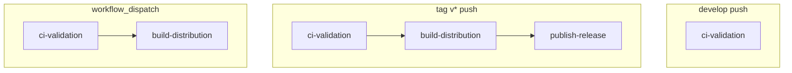

# Release process

## CI behavior

Pushing to **develop** runs validation only (build + full test suite on macOS and Windows).

**No distributable artifacts are generated on develop.** This is intentional.

To create downloadable builds:

- Push a version tag (`vX.Y.Z`)
- Or use **Actions → Scyclone → Run workflow** (workflow_dispatch)

## Pipeline overview



| Trigger | Jobs | Artifacts |
|---------|------|-----------|
| Push `develop` | ci-validation | None |
| Push tag `v*` | ci-validation → build-distribution → publish-release | GitHub Release zips |
| workflow_dispatch | ci-validation → build-distribution | Workflow artifacts (~90 days) |

### Tag push vs manual dispatch

| | Tag `v*` | workflow_dispatch |
|--|----------|-------------------|
| Purpose | Official release | Ad-hoc signed build |
| GitHub Release | Yes | No |
| macOS default | Universal (`arm64` + `x86_64`) | Your choice (`arm64` or `universal`) |
| Version check | Tag must match `CMakeLists.txt` | No |

## Why didn't I get artifacts?

If you pushed to **develop** and expected zips:

1. Check the workflow run — the step summary says validation completed with no artifacts (expected).
2. To ship builds, tag a release or run the workflow manually from the Actions tab.

Develop CI answers: *did the code compile and pass all tests?*

## Release checklist

1. Update version in [`CMakeLists.txt`](../CMakeLists.txt): `project(Scyclone VERSION X.Y.Z)`
2. Commit and merge to `develop`
3. Run the prepare-release script (optional but recommended):
   ```bash
   ./scripts/prepare-release.sh X.Y.Z
   ```
4. Create and push the tag:
   ```bash
   git tag vX.Y.Z
   git push origin vX.Y.Z
   ```
5. Open **GitHub → Releases** and confirm assets:
   - `Scyclone-macOS-vX.Y.Z.zip`
   - `Scyclone-Windows-vX.Y.Z.zip`

CI fails the release if the tag (without `v`) does not match the CMake `VERSION`.

## macOS architectures

| Build type | macOS architecture |
|------------|-------------------|
| develop validation | arm64 (native on CI runner) |
| version tag release | universal (`arm64` + `x86_64`) |
| manual dispatch | arm64 or universal (your choice) |

## Ad-hoc builds

1. Go to **Actions → Scyclone → Run workflow**
2. Select branch (usually `develop`)
3. Choose **distribution_type**: `arm64` or `universal`
4. Download zips from the workflow run (not from Releases)

Manual artifact names include `-manual`, e.g. `Scyclone-macOS-universal-manual.zip`.
