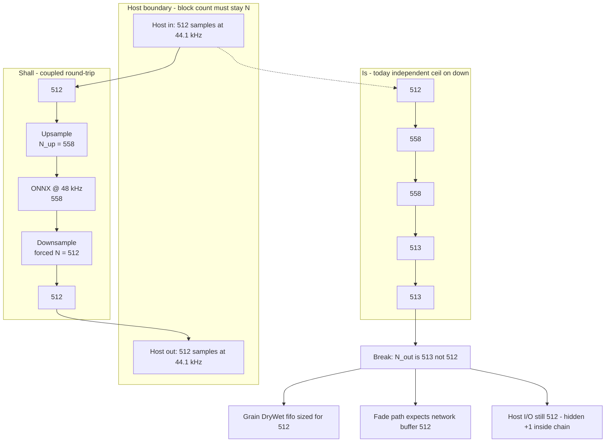
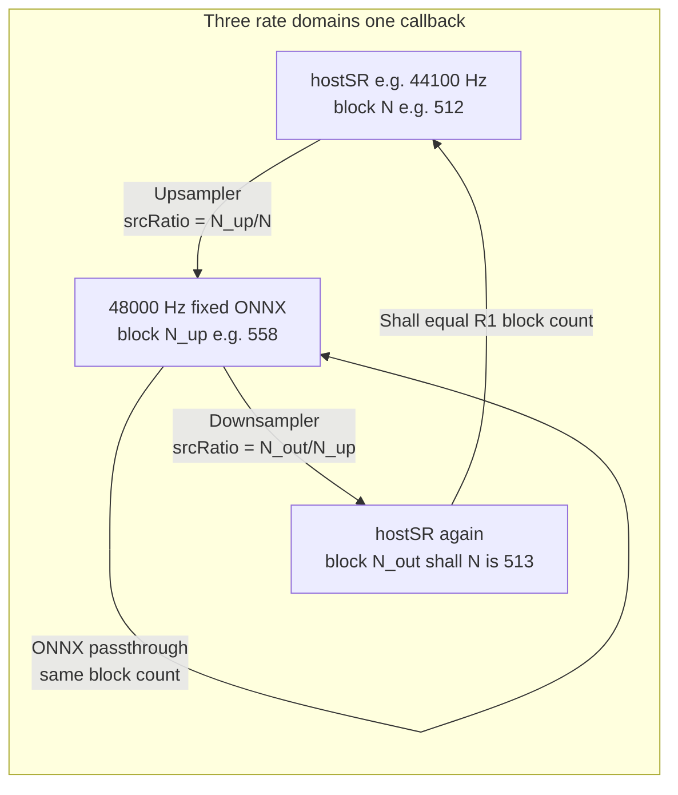
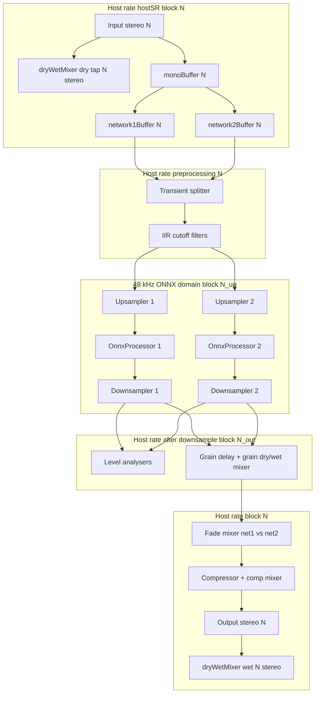
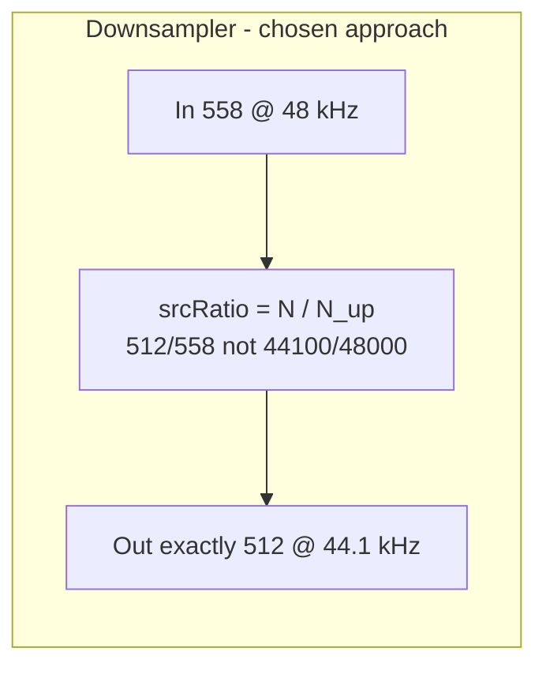
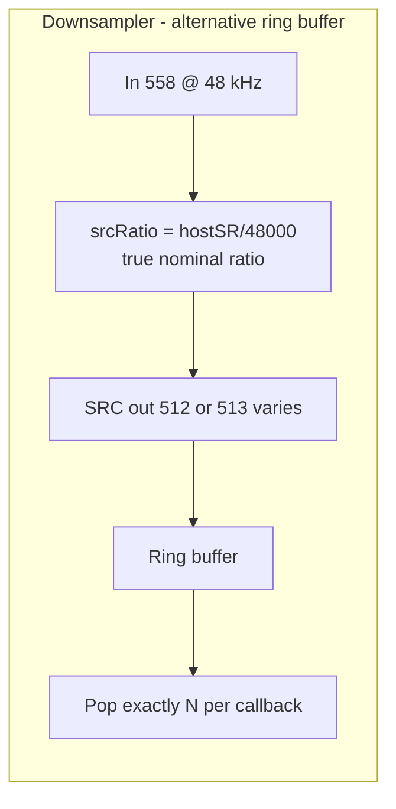
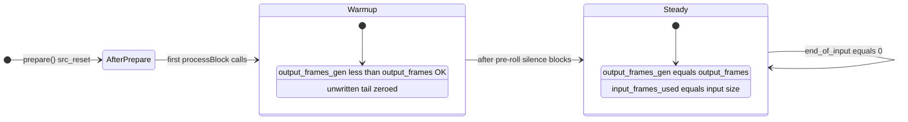

# Scyclone resampling architecture

Internal reference for how sample-rate conversion **shall** work in the plugin graph. Use this document to compare intended behavior against [`PluginProcessor.cpp`](../source/PluginProcessor.cpp) and [`ResamplingProcessor.cpp`](../source/dsp/resampler/ResamplingProcessor.cpp).

For libsamplerate API details (transport delay, `SRC_DATA`, FAQ), see [libsamplerate_usage_notes.md](libsamplerate_usage_notes.md).

---

## Contents

- [Purpose](#purpose)
- [Core idea: block contract at the host boundary](#core-idea-block-contract-at-the-host-boundary)
- [End-to-end signal flow](#end-to-end-signal-flow)
- [Per-edge contracts](#per-edge-contracts)
- [Block size math](#block-size-math)
- [Design decision: enforcing N_out equals N](#design-decision-enforcing-n_out-equals-n)
- [ResamplingProcessor behavior](#resamplingprocessor-behavior)
- [SRC state machine](#src-state-machine)
- [Latency accounting](#latency-accounting)
- [Dual-network symmetry](#dual-network-symmetry)
- [Doc vs code checklist](#doc-vs-code-checklist)
- [Known gaps and planned fixes](#known-gaps-and-planned-fixes)
- [Related files](#related-files)

---

## Purpose

ONNX / RAVE models run at a **fixed 48 kHz** internal rate. The host may run at any standard rate (e.g. 44.1 kHz, 48 kHz, 96 kHz). Scyclone inserts **two resampling stages per network**:

1. **Upsampler** — host rate → 48 kHz (before ONNX)
2. **Downsampler** — 48 kHz → host rate (after ONNX)

Scyclone adds a **fixed block-size contract** on top of libsamplerate’s streaming API so ONNX always receives a predictable block length each callback. That contract is **not** prescribed by libsamplerate itself; see [Scyclone layer vs libsamplerate](libsamplerate_usage_notes.md#relation-to-scyclone).

---

## Core idea: block contract at the host boundary

The single most important rule: **the host drives time.** Each `processBlock` receives `N` samples at `hostSR` and must eventually produce `N` samples back at `hostSR` on the wet path. Sample rate may change inside the ONNX island (48 kHz), but **sample count at the host boundary must round-trip to `N`.**

Everything else (upsampler `ceil`, ONNX block size, latency, grain mixers) exists to serve that rule.

### Intended vs current (44.1 kHz, N = 512)



At **48 kHz** host, `N_up = N_out = N` and the chain is aligned. The mismatch appears whenever `hostSR ≠ 48000` and upsampler/downsampler each apply their own `ceil()` without coupling the downsampler output back to `N`.

### Where rates and block sizes live (one callback)



**Takeaway:** libsamplerate handles **rate** conversion; Scyclone must explicitly enforce **block-count** conservation at the host boundary. The ONNX stage is allowed a different block length (`N_up`), but the downsampler must **close the loop** back to `N` — not an independent third `ceil`.

### What this is not

| Topic | Not the primary issue |
|-------|------------------------|
| libsamplerate transport delay (~47 frames on first block) | Warmup only; steady-state fills after pre-roll |
| Bit-identical round-trip | Expected loss from SRC filters |
| Corrected ratio 48062 vs 48000 Hz | Sub-0.02% pitch offset through ONNX |
| Garbled console output | Debug logging artifact, not audio corruption |

---

## End-to-end signal flow

Both networks share the same topology. Host I/O is stereo; ONNX path is mono.



**Main wet path (plugin dry/wet):** full chain through both networks → stereo output → `dryWetMixer` wet, aligned via `setLatencySamples` / `setWetLatency`.

---

## Per-edge contracts

Symbols:

| Symbol | Meaning |
|--------|---------|
| `hostSR` | Host sample rate from `prepareToPlay(sampleRate, …)` |
| `N` | Host block size = `samplesPerBlock` |
| `N_up` | Upsampler output block size at 48 kHz |
| `N_out` | Downsampler output block size at `hostSR` |
| **Shall** | Intended design (target) |
| **Is** | Current implementation (as of this doc) |

| Edge | Rate | Block size | Prepared in | Code |
|------|------|------------|-------------|------|
| Host I/O | `hostSR` | `N` | `spec` / `monoSpec` | `buffer`, `monoBuffer` |
| Pre-ONNX (`network*Buffer`) | `hostSR` | `N` | `monoSpec` | transient, IIR, upsampler **input** |
| Upsampler output | 48000 | `N_up = ceil(48000/hostSR × N)` | `onnxSpec.maximumBlockSize` | `upsampler*.processBlock()` return |
| ONNX in/out | 48000 | `N_up` | `onnxSpec` | `onnxProcessor*.processBlock(onnxbuffer*)` |
| Downsampler output | `hostSR` | **Shall:** `N` · **Is:** `ceil(hostSR/48000 × N_up)` | *(downsampler internal buffer)* | `networkOut*` |
| Grain dry/wet fifo | `hostSR` | **Shall:** `N` for dry and wet push | `monoSpec` | `grain*DryWetMixer` |
| Fade / comp / final out | `hostSR` | `N` | `monoSpec` | `network*Buffer` after grain section |

### Intended invariant (Scyclone graph contract)

```
N_up = ceil(48000 / hostSR × N)     // upsampler
N_out = N                           // downsampler SHALL match host block
```

ONNX block size equals upsampler output: `onnxSpec.maximumBlockSize = upsamplerOne.prepare(…)`.

---

## Block size math

Formula in [`ResamplingProcessor::setSamplerateRatio()`](../source/dsp/resampler/ResamplingProcessor.cpp):

```text
srcRatio_nominal = outputSampleRate / inputSampleRate
outputBufferSize = ceil(srcRatio_nominal × inputBufferSize)
srcRatio_used    = outputBufferSize / inputBufferSize   // adjusted for fixed blocks
```

Upsampler: `input=hostSR`, `output=48000` → `N_up`.  
Downsampler: `input=48000`, `output=hostSR` → currently **independent** `ceil`, not coupled to `N`.

### Worked examples

| hostSR | N | N_up | N_out (current) | N_out − N | Notes |
|--------|---|------|-----------------|-----------|-------|
| 44100 | 512 | 558 | 513 | **+1** | Primary bug case |
| 44100 | 2048 | 2230 | 2049 | **+1** | Drift at large blocks too |
| 48000 | 512 | 512 | 512 | 0 | Identity |
| 96000 | 512 | 256 | 512 | 0 | Up halves, down doubles |
| 96000 | 32 | 16 | 32 | 0 | Very small ONNX block; see [feasibility](#feasibility-extreme-configs) |

Corrected sample rate through upsampler at 44.1k/512: `558/512 × 44100 ≈ 48062 Hz` (not exactly 48000).

---

## Design decision: enforcing N_out equals N

Closing the host boundary (§ [Core idea](#core-idea-block-contract-at-the-host-boundary)) requires the downsampler to output exactly `N` samples. [libsamplerate FAQ Q6](https://libsndfile.github.io/libsamplerate/faq.html) describes two legitimate techniques:

| # | Technique | How | libsamplerate stance |
|---|-----------|-----|---------------------|
| **1** | **Extra input / output buffering** | Run SRC at the *true* rate ratio; absorb ±1 sample variation in a ring buffer; pop exactly `N` per host callback | **Preferred** for file conversion — “supply more input so delayed samples land in-block” |
| **2** | **Adjust `src_ratio` per block** | Set `outputBufferSize = N`, back-compute `srcRatio_used = N / N_up` | Supported (`src_ratio` may change between calls; see [API](https://libsndfile.github.io/libsamplerate/api_full.html)) — less preferred for exact output counts, but valid |

**Scyclone chooses technique 2 on the downsampler** (planned fix). Rationale:

- Real-time plugin: no extra ring-buffer latency or fill/underflow state
- **Consistent with the existing upsampler**, which already uses technique 2 (`N_up = ceil(...)`, `srcRatio = N_up/N`)
- Magnitude of the ratio nudge is small at practical block sizes (see below)
- Contract tests (`LongRun_SampleCountConservation`, parametrized matrix) catch cases where the nudge would grow large

This is **not** “FAQ Q7 says double precision is enough for ratio” — Q7 addresses static ratio drift over long sessions. Here we deliberately set a *per-block* ratio slightly away from `hostSR/48000` to hit an exact output count. That is technique 2, not Q7.

### Chosen pattern (technique 2) — ratio forcing



```cpp
// Planned: optional forcedOutputBlockSize on prepare()
outputBufferSize = N;   // host block, not ceil(hostSR/48000 * N_up)
srcRatio = static_cast<double>(N) / static_cast<double>(N_up);
```

The downsampler’s `src_ratio` expresses “samples out per sample in *for this block*,” not the literal nominal rate ratio. The deviation from `hostSR/48000` is the price of an exact host block count without buffering.

### Alternative pattern (technique 1) — ring buffer — not adopted

Documented for completeness; **not** the planned implementation.



| Aspect | Technique 2 (chosen) | Technique 1 (ring buffer) |
|--------|----------------------|---------------------------|
| SRC ratio | Nudged to fit `N` | True `hostSR/48000` |
| Extra latency | None | Up to ~1 block (bounded) |
| Extra state | None | Ring fill level, underflow rules |
| Test surface | Existing 8 invariants | + ring invariants |
| libsamplerate alignment | Valid API use; technique 2 | Closer to FAQ Q6 recommendation |

If ratio nudge ever exceeds test thresholds (small `N`, extreme rates), reconsider technique 1 for the downsampler only.

### Magnitude of the ratio nudge

Definitions:

```text
N_up       = ceil(48000 / hostSR × N)           // upsampler (unchanged)
N_out_raw  = ceil(hostSR / 48000 × N_up)       // current independent down ceil
ratio_nom  = hostSR / 48000                     // true rate ratio (down direction: out/in at rate level)
ratio_force = N / N_up                          // planned downsampler src_ratio
```

| Quantity | Meaning | Shrinks when… |
|----------|---------|---------------|
| `N_out_raw − N` | Block-count error without coupling | Often ±1 sample; **relative** error `(N_out_raw−N)/N` ↓ as `N` ↑ |
| `\|ratio_force − ratio_nom\| / ratio_nom` | Per-block pitch ratio nudge through down stage | ↓ as `N` ↑ (ceil residue is ±1 sample) |

Worked values (downsampler, planned `ratio_force = N/N_up`):

| hostSR | N | N_up | N_out_raw | (N_out_raw−N)/N | ratio_nom | ratio_force | Relative ratio error |
|--------|---|------|-----------|-----------------|-----------|-------------|----------------------|
| 44100 | 32 | 35 | 33 | +3.1% | 0.91875 | 0.91429 | **0.49%** |
| 44100 | 512 | 558 | 513 | +0.20% | 0.91875 | 0.91756 | **0.13%** |
| 44100 | 2048 | 2230 | 2049 | +0.05% | 0.91875 | 0.91839 | **0.04%** |
| 48000 | 512 | 512 | 512 | 0 | 1.00000 | 1.00000 | 0 |
| 96000 | 512 | 256 | 512 | 0 | 2.00000 | 2.00000 | 0 |

**Upsampler already applies the same class of nudge** (`srcRatio = N_up/N` vs nominal `48000/hostSR`). At 44.1k/512 upsampler relative ratio error is ~**0.13%** as well. The planned down fix makes both stages symmetric rather than introducing a new mechanism.

**Safety bound:** exclude host configs where `N_up < 32` or relative ratio error / block-count error exceeds test thresholds (Tier B matrix + `isFeasibleHostConfig`). Small blocks at 44.1k (N=32) have the largest nudge (~0.5%) — flag in test matrix, not silent production use.

---

## ResamplingProcessor behavior

| Aspect | Design |
|--------|--------|
| Library | [libsamplerate](https://libsndfile.github.io/libsamplerate/) Full API |
| Converter | `SRC_SINC_MEDIUM_QUALITY` |
| Channels | Mono (1) |
| State | One `SRC_STATE*` per instance; persists across `processBlock` calls |
| Streaming | `end_of_input = 0` in `processBlock` |
| Reset | `src_reset()` only after impulse latency test in `prepare()` |
| Partial output | If `output_frames_gen < output_frames`, tail is **zeroed** (warmup); see [SRC state machine](#src-state-machine) |
| Latency report | Impulse test in `prepare()`; `getLatencyInSamples()` in **input-rate** samples of that processor |
| Not tracked today | `input_frames_used` after `src_process` |

Implementation: [`ResamplingProcessor.h`](../source/dsp/resampler/ResamplingProcessor.h), [`ResamplingProcessor.cpp`](../source/dsp/resampler/ResamplingProcessor.cpp).

---

## SRC state machine



| Phase | Expected behavior | Test implication |
|-------|-------------------|------------------|
| **Warmup** | Transport delay; partial blocks OK ([FAQ Q6](https://libsndfile.github.io/libsamplerate/faq.html)) | Do not fail on first block(s) after `prepare` |
| **Steady** | Full output buffer each block; full input consumed | Assert after 4–8 block pre-roll |

---

## Latency accounting

Reported to host via `setLatencySamples(totalLatency)` and wet path via `dryWetMixer.setWetLatency(totalLatency)`.

[`prepareResamplingAndOnnx()`](../source/PluginProcessor.cpp):

```cpp
totalLatency = computeTotalLatencyInSamples(
    upsamplerOne.getLatencyInSamples(),   // host-rate samples
    max(onnx1, onnx2 latency),            // 48 kHz samples
    downsamplerOne.getLatencyInSamples(), // reported as 48 kHz domain input — see below
    48000.0,
    hostSR);
```

[`computeTotalLatencyInSamples()`](../source/dsp/utils/utils.cpp):

```text
totalSeconds = upLatency/hostSR + (onnxLatency + downLatency)/48000
totalLatency = round(totalSeconds × hostSR)
```

| Component | Domain of `getLatencyInSamples()` |
|-----------|-----------------------------------|
| Upsampler | Input = **host** rate |
| ONNX | **48 kHz** (block-aligned) |
| Downsampler | Input = **48 kHz** (downsampler’s input rate) |

**Note:** Impulse test in `prepare()` uses `outputSampleRate/inputSampleRate` ratio, while streaming uses adjusted `srcRatio` — small sub-sample difference possible.

Grain mixers do **not** receive `setWetLatency`.

---

## Dual-network symmetry

| Instance | Upsampler | ONNX | Downsampler |
|----------|-----------|------|-------------|
| Network 1 | `upsamplerOne` | `onnxProcessor1` | `downsamplerOne` |
| Network 2 | `upsamplerTwo` | `onnxProcessor2` | `downsamplerTwo` |

Both chains are prepared with the same `monoSpec` / `onnxSpec`. Latency uses `max(onnxProcessor1, onnxProcessor2)`.

---

## Doc vs code checklist

Filled during Phase 0 review (current codebase).

| # | Doc claim | Code location | Match? |
|---|-----------|---------------|--------|
| 1 | Host block size `N` everywhere at host rate after downsample | `buffer.getNumSamples()`, `monoSpec.maximumBlockSize` | **Yes** — downsampler `forcedOutputBlockSize = N` |
| 2 | `N_up = ceil(48000/hostSR × N)` | `setSamplerateRatio()` upsampler | **Yes** |
| 3 | `N_out = N` (intended) | `downsampler*.prepare(..., monoSpec.maximumBlockSize)` | **Yes** |
| 4 | `onnxSpec.maximumBlockSize = upsamplerOne.prepare()` | `prepareResamplingAndOnnx` L189–191 | **Yes** |
| 5 | ONNX processes same block count as upsampler output | `processBlock(onnxbuffer*)` | **Yes** |
| 6 | Downsampler input size = upsampler output size | down `inputBufferSize` from `onnxSpec` | **Yes** at prepare time |
| 7 | `end_of_input = 0` during streaming | `processBlock` | **Yes** |
| 8 | `src_reset` only in prepare after impulse test | `prepare()` after impulse | **Yes** |
| 9 | Partial output tail zeroed | warmup branch in `processBlock` | **Yes** |
| 10 | Main dry/wet latency compensation | `setLatencySamples`, `dryWetMixer.setWetLatency` | **Yes** |
| 11 | Grain dry = post-downsample copy | `grain1DryBuffer.makeCopyOf(networkOut1)` | **Yes** |
| 12 | Grain wet = post-grain networkOut (intended) | `setWetSamples(networkOut1)` | **Yes** |
| 13 | Grain delay output reaches mix bus | `network1Buffer.makeCopyOf(networkOut1)` after mix | **Yes** |
| 14 | Grain mixer fifo sized for `N` | `grain1DryWetMixer.prepare(monoSpec)` | **Yes** |
| 15 | Comment: down output fixed at host block | `processBlock` downsample comment | **Yes** |
| 16 | `ON_OFF_NETWORK2` init reads own param | `setInitialMuteParameters` | **Yes** |
| 17 | UI warns non-48k host | `WarningWindow` SampleRateWarning | **Yes** — resampling active |
| 18 | Impulse latency uses streaming `srcRatio` | `prepare()` impulse test | **Yes** |
| 19 | `input_frames_used` / `output_frames_gen` observable | `ResamplingProcessor` getters | **Yes** |
| 20 | No audio-path `std::cout` in dsp | ResamplingProcessor, OnnxProcessor, InferenceThread | **Yes** |

---

## Known gaps and planned fixes

All items below were addressed in the resampling TDD pass (contract tests + production fixes).

| Gap | Status |
|-----|--------|
| `N_out ≠ N` at 44.1k (+1) | **Fixed** — downsampler `forcedOutputBlockSize = N` |
| Grain wet uses pre-ONNX buffer | **Fixed** — `setWetSamples(networkOut*)` |
| Grain fifo 513 vs 512 | **Fixed** — coupled downsampler output |
| `ON_OFF_NETWORK2` wrong param ID | **Fixed** |
| Impulse vs streaming `srcRatio` | **Fixed** |
| `input_frames_used` not tracked | **Fixed** — getters + tests |
| Audio-path `std::cout` | **Fixed** |

### Feasibility: extreme configs

| Config | Issue |
|--------|--------|
| 96 kHz, N=32 | `N_up = 16` — ONNX block very small; exclude from test matrix or `GTEST_SKIP` |
| Any `N_up < 32` | May violate practical ONNX minimum; document in tests |

---

## Related files

| File | Role |
|------|------|
| [`source/PluginProcessor.cpp`](../source/PluginProcessor.cpp) | Graph wiring, prepare, latency report |
| [`source/dsp/resampler/ResamplingProcessor.cpp`](../source/dsp/resampler/ResamplingProcessor.cpp) | libsamplerate wrapper |
| [`source/dsp/onnx/OnnxProcessor.cpp`](../source/dsp/onnx/OnnxProcessor.cpp) | 48 kHz inference + ring buffer |
| [`source/dsp/utils/utils.cpp`](../source/dsp/utils/utils.cpp) | Total latency formula |
| [`test/LatencyCompensationTest.cpp`](../test/LatencyCompensationTest.cpp) | Latency unit tests |
| [`test/ResamplingContractsTest.cpp`](../test/ResamplingContractsTest.cpp) | Graph contract + isolation tests |
| [`test/ResamplingSignalTest.cpp`](../test/ResamplingSignalTest.cpp) | Silence / NaN signal checks |
| [`test/PluginGraphContractTest.cpp`](../test/PluginGraphContractTest.cpp) | Grain routing + param wiring |
| [`test/ResamplingTestHelpers.h`](../test/ResamplingTestHelpers.h) | Shared test helpers |
| [`docs/libsamplerate_usage_notes.md`](libsamplerate_usage_notes.md) | Library usage (not graph architecture) |

### Test commands

```powershell
cmake --build c:\_Dev\Scyclone\build --target Test --config Debug

# Tier A (CI fast)
c:\_Dev\Scyclone\build\Debug\Test.exe --gtest_filter="*TierA*"

# Isolation (uncoupled down ceil regression)
c:\_Dev\Scyclone\build\Debug\Test.exe --gtest_filter="*Isolation*"

# Tier B (full matrix)
c:\_Dev\Scyclone\build\Debug\Test.exe --gtest_filter="*TierB*"

# RT safety (soft)
powershell -File githooks/check-dsp-cout.ps1
```

---

## Revision history

| Date | Change |
|------|--------|
| 2025-06-13 | Phase 0 initial architecture doc + code checklist |
| 2025-06-13 | Design decision: technique 2 vs ring buffer; ratio nudge magnitude table |
| 2025-06-13 | Phase 1–5 complete: contract tests, downsampler coupling, grain fix, cout removal |
